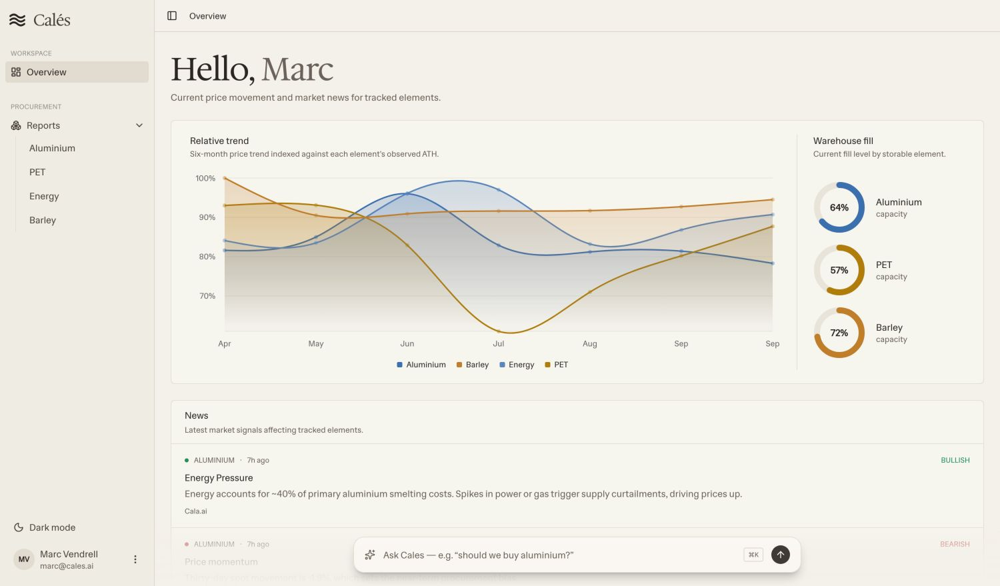
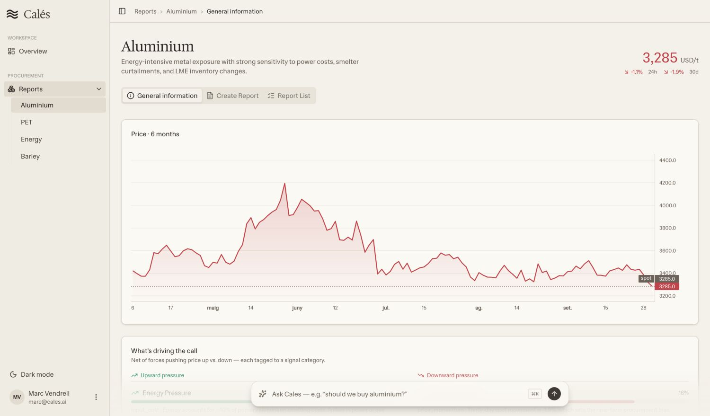
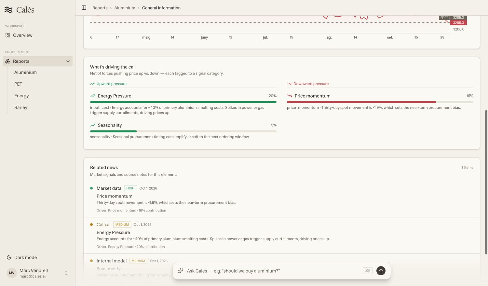
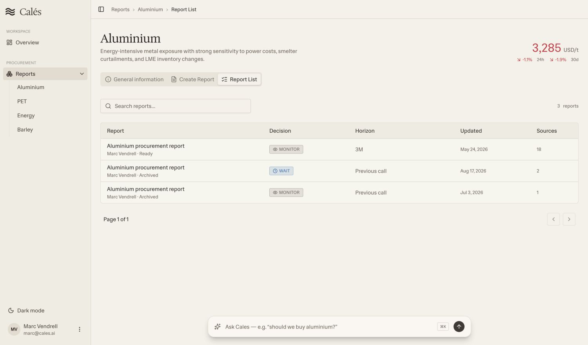
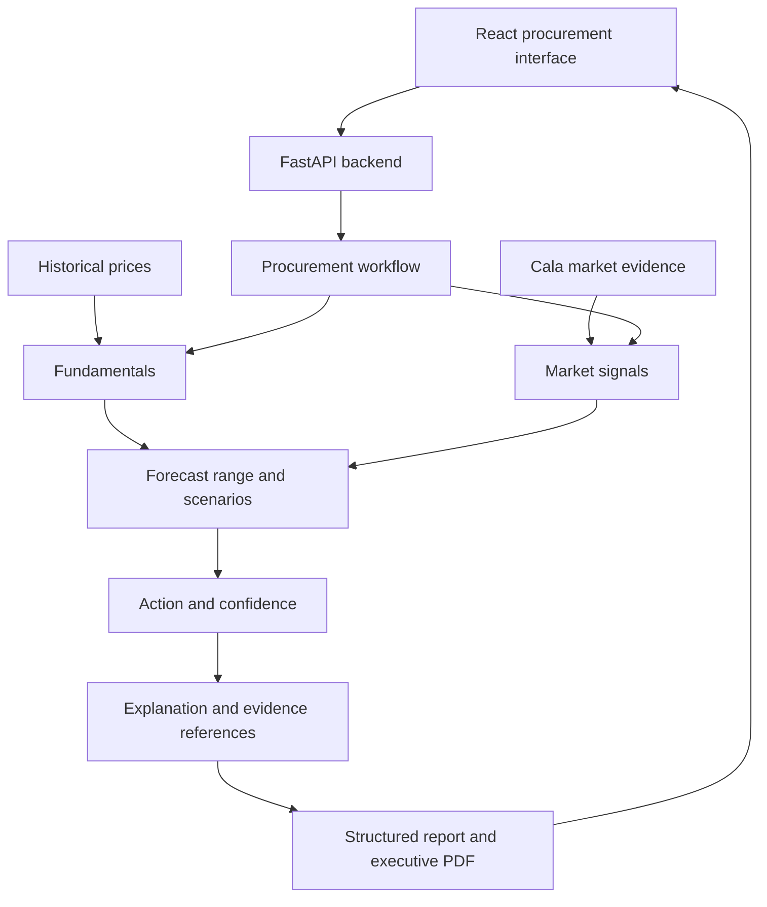

<p align="center">
  <strong>Decide whether to buy, wait, hedge or monitor raw materials.</strong>
</p>

<h1 align="center">Calés</h1>

<p align="center">
  A five-agent procurement tool built for Damm.<br/>
  Winner of the overall prize and Best Use of Cala at the Damm x Engineering Hub Hackathon.
</p>

<h3 align="center"><a href="https://cales.marcvendrell.cat"><ins>Open the demo</ins></a></h3>

<p align="center">
  <a href="#features">Features</a> ·
  <a href="#architecture">Architecture</a> ·
  <a href="#run-locally">Run locally</a> ·
  <a href="https://github.com/josep-audenis/cales-backend">Backend repository</a>
</p>

<p align="center">
  <a href="assets/screenshots/overview.jpg"></a>
</p>

Damm supplied weekly price data for one commodity from 2006 to 2025 and a 26-week forecast horizon. We built a tool that combines price history, inventory and external evidence into a procurement recommendation, with workspaces for aluminium, PET, energy and barley.

The deployed app uses demo data and saved reports. The screenshots below come from that deployment, captured in Chrome.

## Features

<table>
<tr>
<td width="50%" valign="middle">
<h3>1. Inspect a material</h3>
<p>Review historical prices and recent movement in a workspace for each material. Aluminium, PET, energy and barley each have their own market context and report history.</p>
</td>
<td width="50%">
<a href="assets/screenshots/material.jpg"></a>
</td>
</tr>
<tr>
<td width="50%" valign="middle">
<h3>2. Follow the market drivers</h3>
<p>Compare upward and downward price pressures, then read the linked market signals. Each source note shows its reliability and contribution to the analysis.</p>
</td>
<td width="50%">
<a href="assets/screenshots/drivers.jpg"></a>
</td>
</tr>
<tr>
<td width="50%" valign="middle">
<h3>3. Choose the report context</h3>
<p>Select the date, spot price, warehouse position, market drivers and news to include. The report builder makes those inputs visible before an analysis starts.</p>
</td>
<td width="50%">
<a href="assets/screenshots/report-builder.jpg"></a>
</td>
</tr>
<tr>
<td width="50%" valign="middle">
<h3>4. Review previous recommendations</h3>
<p>Search saved reports and compare their actions, horizons, dates and source counts. The report viewer connects each recommendation to forecast scenarios, evidence and conditions to monitor.</p>
</td>
<td width="50%">
<a href="assets/screenshots/reports.jpg"></a>
</td>
</tr>
</table>

---

## Architecture

<p>
  <kbd>React + TypeScript</kbd> &nbsp; <kbd>Vite</kbd> &nbsp; <kbd>FastAPI</kbd> &nbsp;
  <kbd>Pydantic</kbd> &nbsp; <kbd>OpenAI Agents SDK</kbd> &nbsp; <kbd>Cala</kbd> &nbsp; <kbd>MapLibre</kbd>
</p>



### Design decisions

| Decision | Why we made it |
| --- | --- |
| Recommend an action | A price forecast is one input to a buying decision. The report also includes inventory, market drivers, a time horizon and conditions to monitor. |
| Separate the five roles | Fundamentals, Cala signals, forecasting, decision scoring and explanation each have a defined responsibility and structured handoffs. |
| Calculate forecasts and scores in code | The current backend uses deterministic tools to collect signals, calculate forecasts and score decisions. The language model writes the explanation from those results. |
| Keep the evidence in the report | Sources, market drivers and scenarios remain part of the report structure, so the interface can show how they relate to the recommendation. |
| Share a typed report structure | TypeScript types and Pydantic schemas define the frontend and backend report format. API requests have timeouts, and the interface shows loading and error states. |

This repository contains the frontend. The [backend repository](https://github.com/josep-audenis/cales-backend) contains the analysis workflow, Cala integration, report schemas and executive PDF generation.

## Deployment

The [demo](https://cales.marcvendrell.cat) runs on Vercel. The [deployment backend](https://github.com/marcvendrellf/cales-backend) runs on Render and includes saved reports and pre-generated executive PDFs.

The hosted app uses fixture data and demo report outputs. It does not run fresh Cala research or the live agent pipeline.

## Run locally

```sh
npm install
npm run dev
```

Without API configuration, the application uses `src/data/mock.ts`. To connect a local backend, copy `.env.example` to `.env.local` and set the backend URLs.

```dotenv
VITE_API_URL=http://localhost:8000
VITE_AGENT_API_URL=http://localhost:8000
VITE_UI_AGENT_API_URL=http://localhost:8000
```

`VITE_UI_AGENT_API_URL` is optional. If you omit it, the interface assistant uses `VITE_AGENT_API_URL` and calls `/agent/ui`.

## Validation and limits

Run the frontend checks locally with these commands.

```sh
npm run lint
npm run build
```

Demo prices, recommendations and confidence scores come from prototype data. Report pages require WebGL for their map and currently do not have a fallback when the browser cannot create a WebGL context.

## Team

Built by Josep Audenis, Marc Vendrell and Guillem Cadevall.
