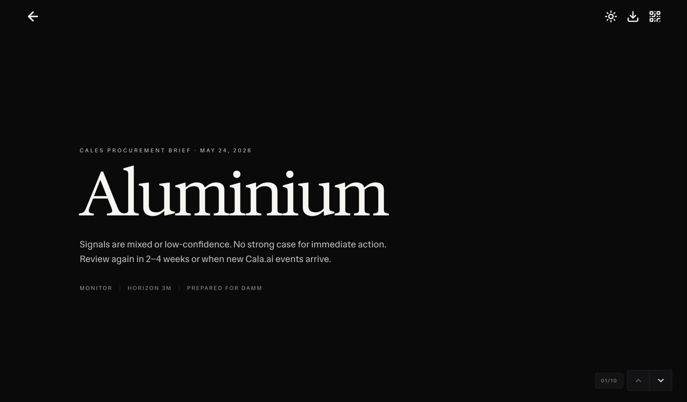
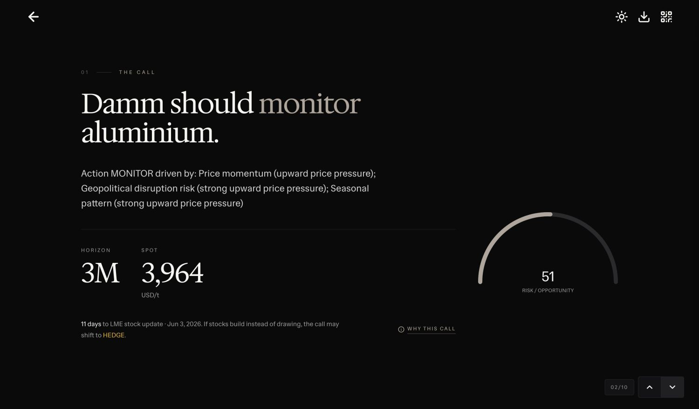
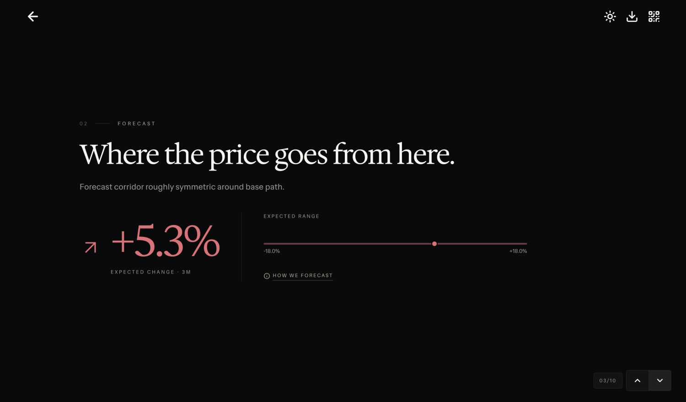
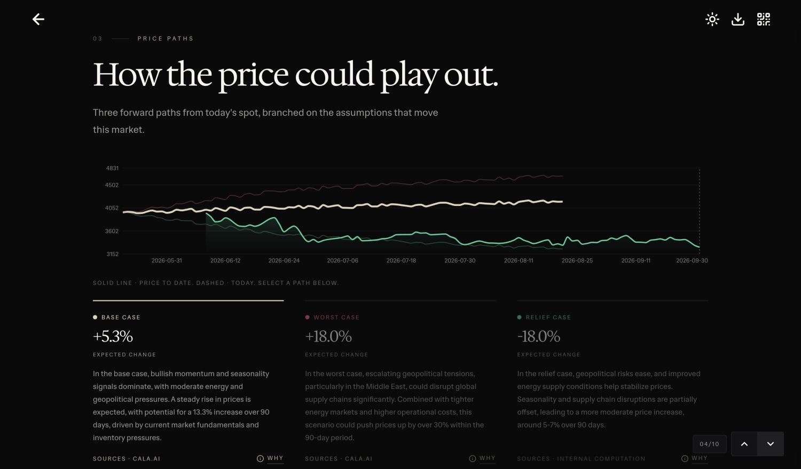
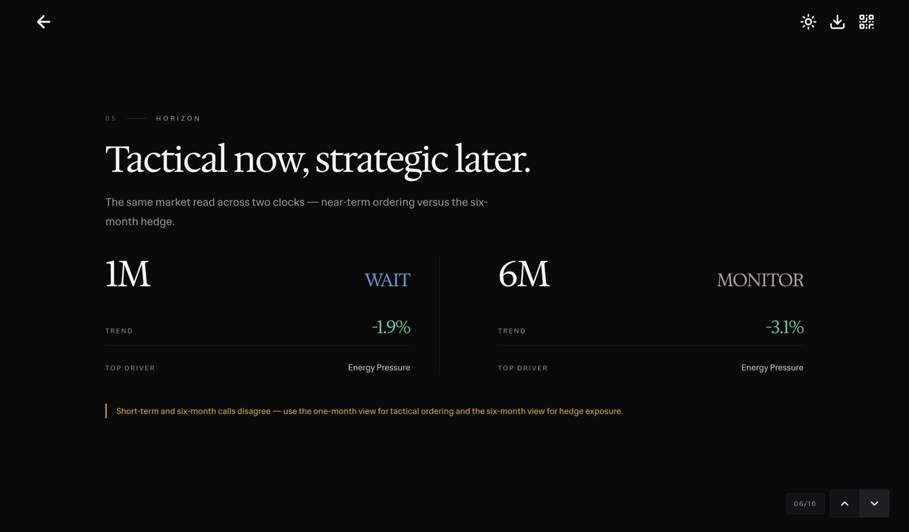
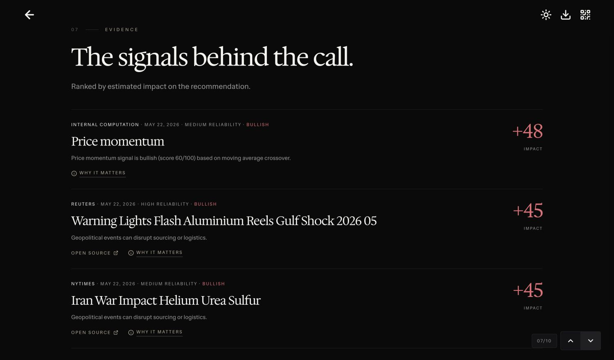
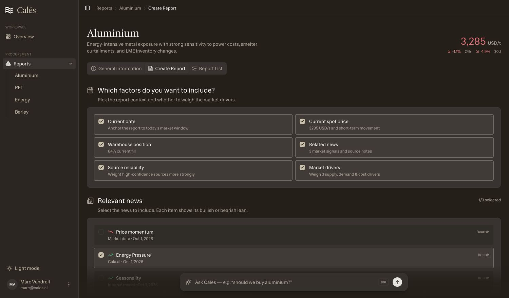
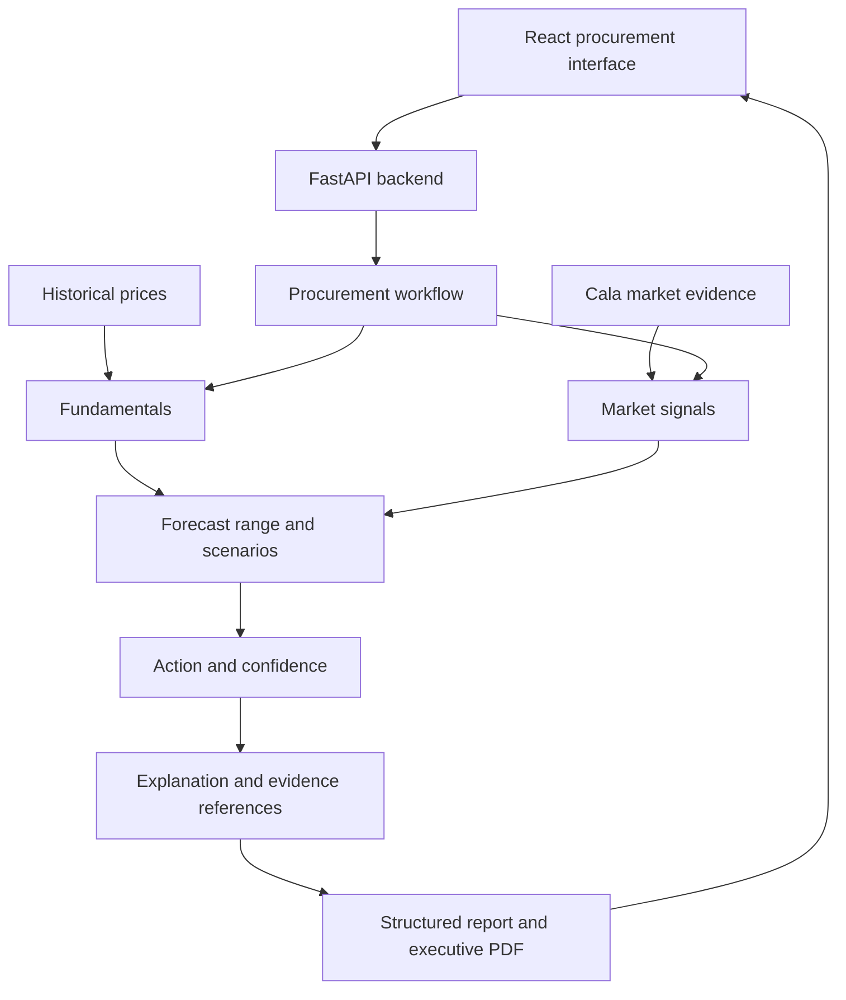

<p align="center">
  <strong>Decide whether to buy, wait, hedge or monitor raw materials.</strong>
</p>

<h1 align="center">Calés</h1>

<p align="center">
  A five-agent procurement tool built for Damm.<br/>
  Winner of the overall prize and Best Use of Cala at the Damm x Engineering Hub Hackathon.
</p>

<h3 align="center"><a href="https://cales.marcvendrell.cat"><ins>Open the demo</ins></a></h3>

<p align="center">
  <a href="#features">Features</a> ·
  <a href="#architecture">Architecture</a> ·
  <a href="#run-locally">Run locally</a> ·
  <a href="https://github.com/josep-audenis/cales-backend">Backend repository</a>
</p>

<p align="center">
  <a href="assets/screenshots/report-cover.jpg"></a>
</p>

Damm supplied weekly price data for one commodity from 2006 to 2025 and a 26-week forecast horizon. We built a tool that combines price history, inventory and external evidence into a procurement recommendation, with workspaces for aluminium, PET, energy and barley.

The deployed app uses demo data and saved reports. Each report has ten slides covering the recommendation, forecast, price paths, drivers, buying horizons, geographic exposure, evidence, monitoring and audit trail. The screenshots below show the deployed report in dark mode, captured in Chrome.

## Features

<table>
<tr>
<td width="50%" valign="middle">
<h3>1. Read the procurement call</h3>
<p>Start with a buy, wait, hedge or monitor recommendation. The report puts the action, time horizon, spot price and risk score together, with an explanation of the call and the next event to watch.</p>
</td>
<td width="50%">
<a href="assets/screenshots/report-call.jpg"></a>
</td>
</tr>
<tr>
<td width="50%" valign="middle">
<h3>2. Inspect the forecast range</h3>
<p>See the expected price change alongside its range over the selected horizon. Open the forecast explanation to inspect the assumptions behind those numbers.</p>
</td>
<td width="50%">
<a href="assets/screenshots/report-forecast.jpg"></a>
</td>
</tr>
<tr>
<td width="50%" valign="middle">
<h3>3. Compare the price paths</h3>
<p>Explore the base, worst and relief cases on one chart. Select a path to read its assumptions and source references, then use the explanation controls to inspect how the scenario was built.</p>
</td>
<td width="50%">
<a href="assets/screenshots/report-price-paths.jpg"></a>
</td>
</tr>
<tr>
<td width="50%" valign="middle">
<h3>4. Compare buying horizons</h3>
<p>Read the one-month and six-month views side by side. Each view has its own action, trend and top driver, with a note when tactical ordering and longer-term hedge exposure point in different directions.</p>
</td>
<td width="50%">
<a href="assets/screenshots/report-horizon.jpg"></a>
</td>
</tr>
<tr>
<td width="50%" valign="middle">
<h3>5. Follow the evidence</h3>
<p>Read the signals ranked by their estimated impact on the recommendation. Each item shows its source, date, reliability and direction, with links to the source and an explanation of why it matters.</p>
</td>
<td width="50%">
<a href="assets/screenshots/report-evidence.jpg"></a>
</td>
</tr>
<tr>
<td width="50%" valign="middle">
<h3>6. Choose the report context</h3>
<p>Select the date, spot price, warehouse position, market drivers and news to include. The material workspace also provides historical prices and saved reports for aluminium, PET, energy and barley.</p>
</td>
<td width="50%">
<a href="assets/screenshots/report-builder.jpg"></a>
</td>
</tr>
</table>

---

## Architecture

<p>
  <kbd>React + TypeScript</kbd> &nbsp; <kbd>Vite</kbd> &nbsp; <kbd>FastAPI</kbd> &nbsp;
  <kbd>Pydantic</kbd> &nbsp; <kbd>OpenAI Agents SDK</kbd> &nbsp; <kbd>Cala</kbd> &nbsp; <kbd>MapLibre</kbd>
</p>



### Design decisions

| Decision | Why we made it |
| --- | --- |
| Recommend an action | A price forecast is one input to a buying decision. The report also includes inventory, market drivers, a time horizon and conditions to monitor. |
| Separate the five roles | Fundamentals, Cala signals, forecasting, decision scoring and explanation each have a defined responsibility and structured handoffs. |
| Calculate forecasts and scores in code | The current backend uses deterministic tools to collect signals, calculate forecasts and score decisions. The language model writes the explanation from those results. |
| Keep the evidence in the report | Sources, market drivers and scenarios remain part of the report structure, so the interface can show how they relate to the recommendation. |
| Share a typed report structure | TypeScript types and Pydantic schemas define the frontend and backend report format. API requests have timeouts, and the interface shows loading and error states. |

This repository contains the frontend. The [backend repository](https://github.com/josep-audenis/cales-backend) contains the analysis workflow, Cala integration, report schemas and executive PDF generation.

## Deployment

The [demo](https://cales.marcvendrell.cat) runs on Vercel. The [deployment backend](https://github.com/marcvendrellf/cales-backend) runs on Render and includes saved reports and pre-generated executive PDFs.

The hosted app uses fixture data and demo report outputs. It does not run fresh Cala research or the live agent pipeline.

## Run locally

```sh
npm install
npm run dev
```

Without API configuration, the application uses `src/data/mock.ts`. To connect a local backend, copy `.env.example` to `.env.local` and set the backend URLs.

```dotenv
VITE_API_URL=http://localhost:8000
VITE_AGENT_API_URL=http://localhost:8000
VITE_UI_AGENT_API_URL=http://localhost:8000
```

`VITE_UI_AGENT_API_URL` is optional. If you omit it, the interface assistant uses `VITE_AGENT_API_URL` and calls `/agent/ui`.

## Validation and limits

Run the frontend checks locally with these commands.

```sh
npm run lint
npm run build
```

Demo prices, recommendations and confidence scores come from prototype data. The interactive map requires WebGL. If the map cannot load, the report keeps its text, charts and location details available.

## Team

Built by Josep Audenis, Marc Vendrell and Guillem Cadevall.
